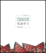

# My Solutions to Exercises in *Machine Learning* Book
This repository is used to record my solutions to _machine learning_ exercises
## About the book _machine learning_
This book, written by Professor Zhou Zhihua, is intended as a textbook for undergraduate or graduate students who want to learn machine learning.

[This book's Douban page](https://book.douban.com/subject/26708119/)
## Task list
- [x] Chapter1 Introduction
- [directory of chapter1's solution](solutions/chapter1)
- [Explain video page in Bilibili](https://www.bilibili.com/video/BV1rZ4y1B74z?spm_id_from=333.999.0.0)
- [reference page in CSDN](https://blog.csdn.net/dicker6315/article/details/81265066)
- [ ] Chapter2 Model evaluation and selection
- [ ] Chapter3 Linear model
- [ ] Chapter4 Decision tree
- [ ] Chapter5 Neural network
- [ ] Chapter6 Support vector machine
- [ ] Chapter7 Bayesian classification
- [ ] Chapter8 Integrated learning
- [ ] Chapter9 Clustering
- [ ] Chapter10 Dimension reduction and metric learning
- [ ] Chapter11 Feature selection and sparse learning
- [ ] Chapter12 Computational learning theory
- [ ] Chapter13 Semi-supervised learning
- [ ] Chapter14 Probability graph mode
- [ ] Chapter15 Rule learning
- [ ] Chapter16 Reinforcement learning
